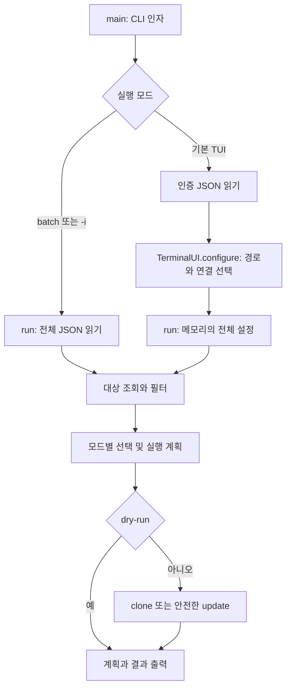

# 프로젝트 구조와 실행 흐름

## 런타임 모듈

| 파일 | 책임 |
| --- | --- |
| `repo_cloner.py` | CLI 인자, JSON 검사, API 인증·재시도·페이지 순회, 실행 계획, 안전한 Git 작업, 집계 |
| `repo_cloner_tui.py` | 터미널 모드 복구, 키 입력, 경로 편집, 단일·복수 선택, 최종 확인, 메모리상의 실행 설정 |
| `repo_cloner_progress.py` | 실행 대시보드, stdout/stderr 수집, 비대화형 Git 인증, 취소 시 프로세스 트리 정리 |

설치 명령 `repo-cloner`는 pyproject.toml의 `repo_cloner:main`을 호출합니다.
`python repo_cloner.py`도 같은 main을 호출합니다. TUI는 기본 모드이며 batch/-i는 TUI 모듈을 불러오지 않습니다.

TUI configure가 생성하는 destination/protocol/sources는 파일에 저장되지 않습니다.
run은 같은 실행 엔진을 세 모드에서 재사용합니다. `-i`는 번호 기반 선택,
TUI는 UI 선택 함수를 전달하며 batch는 선택 단계를 생략합니다.

API 목록 조회는 동기적으로 수행하고 저장소도 순차 처리합니다.
batch/-i의 진행률 heartbeat는 경과 시간을 출력할 뿐 clone을 병렬 실행하지 않습니다.
TUI에서는 ContextVar로 실행 범위에만 Git 실행 어댑터를 연결합니다. Git stdout/stderr는 별도 reader 스레드가 수집하고,
메인 스레드는 진행 화면과 취소 키를 처리합니다. Git 내부 검사에 필요한 stdout은 원래 형식으로 실행 엔진에 반환합니다.
TUI Git 프로세스에는 stdin 비활성화, GIT_TERMINAL_PROMPT=0, GCM_INTERACTIVE=never를 적용합니다.
기존 SSH 실행 파일과 옵션을 유지하면서 OpenSSH에는 BatchMode=yes·StrictHostKeyChecking=yes,
PuTTY/plink 계열에는 -batch를 적용합니다. 사용자 정의 SSH 래퍼는 이 옵션을 지원해야 합니다.
설정은 자식 프로세스 환경에만 적용하며 전역 Git/SSH 설정을 변경하지 않습니다.
Git 명령의 안전 조건과 원격 식별 정책은 [SAFETY.md](SAFETY.md)를 참고하세요.

## 지원 파일

- `docs/`: 주제별 문서. README는 설치·시작과 주요 동작을 설명하고 상세 문서로 연결합니다.
- `examples/`: 비밀 값 대신 placeholder를 사용한 설정. 개인 작업 파일로 복사해서 사용합니다.
- `tests/`: API·키 입력 mock 테스트와 실제 임시 Git 원격을 이용한 갱신 테스트입니다.
- `.github/`: CI, 이슈 양식, PR 템플릿입니다.
- `CONTRIBUTING.md`: 개발·검증 절차입니다. `CHANGELOG.md`는 동작·호환성 변경을 기록합니다.

현재는 설치 없이 Python 파일을 실행하는 사용법을 지원하기 위해 런타임 모듈을 루트에 유지합니다.
src/ 패키지로 전환하면 import·console entry point·직접 실행·테스트를 함께 변경해야 하므로
단순 문서 정리를 위한 이동은 하지 않습니다.

루트의 `gjc-install.ps1`은 별도 GJC 도구 설치 스크립트이며 repo-cloner 런타임이나 설치 과정에서 사용하지 않습니다.

[README](../README.md) · [기여 방법](../CONTRIBUTING.md)
